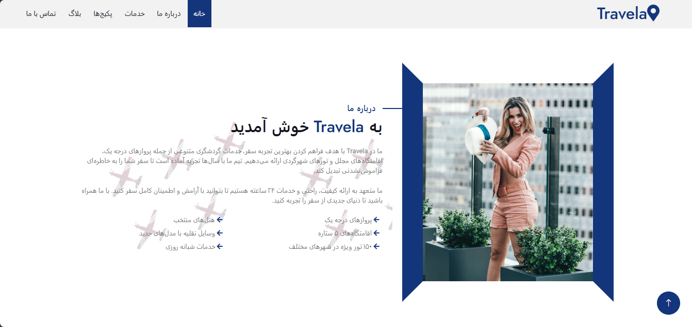
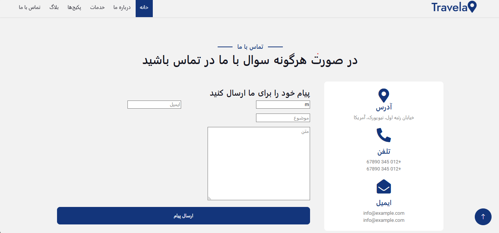
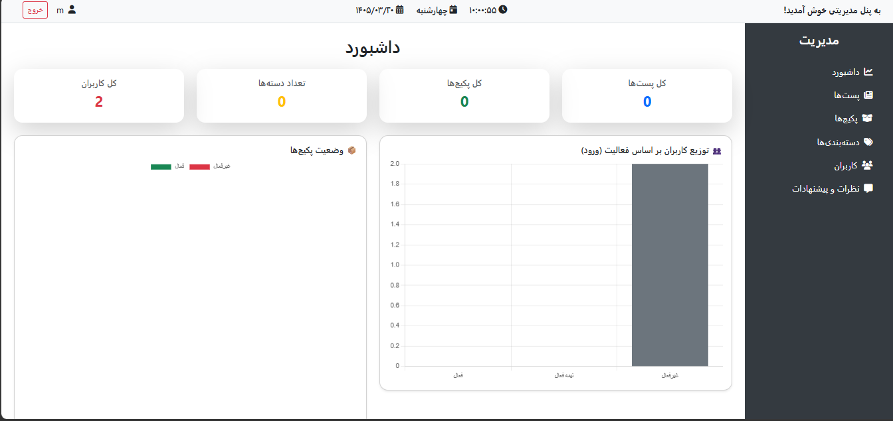
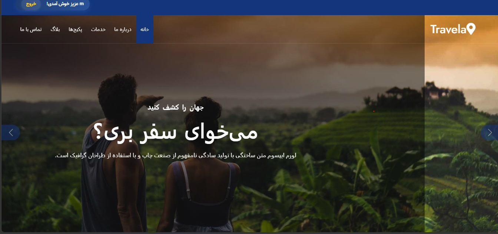
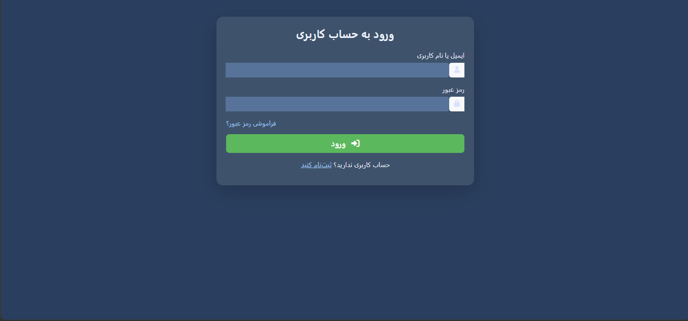
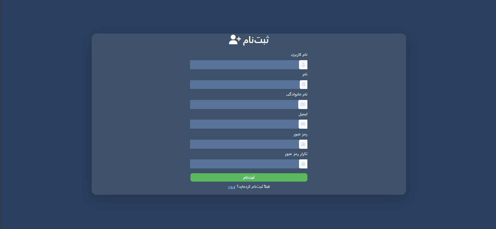
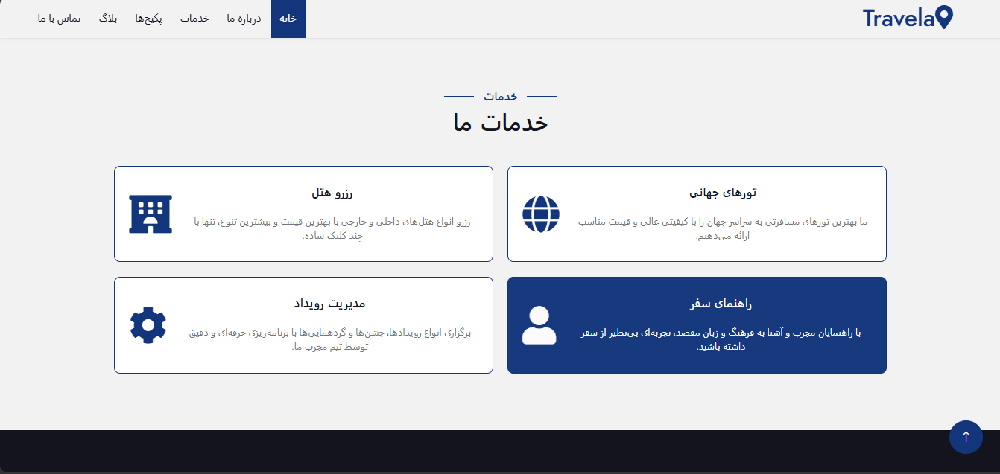

# Project Name

Travela is a personal Django-based travel and tourism platform built as a learning and experimentation project. The application allows users to browse travel packages, purchase tours, and submit reviews and feedback. It also provides an administration dashboard for monitoring and managing different sections of the platform.

This project was developed to gain hands-on experience with building feature-rich web applications and implementing concepts commonly used in real-world systems. The repository is maintained as a sample project to showcase my development journey and has not been used in a production environment.


## Features
* User Authentication
* Product Management
* Order Management
* Role-Based Permissions
* Search and Filtering


### Backend

* Python
* Django

### Frontend

* HTML
* CSS
* JavaScript


### Database

* MySQL

## Project Structure

```text
BLOG-PROJECT/
│
├── accounts 
├── blog => main app
├── dashboard => admin panel
├── screenshots => images for the project
├── static
├── STATICS
├── Templates
├── venv
├── WebSite => main project
├── .env
├── .gitattributes
├── .gitignore
└── manage.py
├── README.md
├── requirements.txt

---

## Installation

Clone the repository:

```bash
git clone https://github.com/mohammad6206/blog-project.git

```

Install dependencies:

```bash
pip install -r requirements.txt
```

---

## Environment Variables

Create a `.env` file based .

Example:

```env
DEBUG=True

SECRET_KEY=django-insecure-v*6)1r1gmgek&e1vyi&8yxi*y8@n41&k*8wb-b4jcfno8w4uy_


ALLOWED_HOSTS=127.0.0.1,localhost,127.0.1:8000


DB_NAME=blog-database
DB_USER=root
DB_PASSWORD=blog1234
DB_HOST=localhost
DB_PORT=3306


```

---

## Run Locally

Apply migrations:

```bash
first => python manage.py makemigrations
then => python manage.py migrate
```

Start the server:

```bash
python manage.py runserver
```

login to admin panel :

address: http://127.0.0.1:8000/dashboard

---

## Screenshots


### About Page



### Connect With Us Page




### AdminPanel Page



### Home Page



### Login Page




### Register Page



### Services Page



**Your Name**

Full-stack Web Developer | Django & React

GitHub: https://github.com/mohammad6206

LinkedIn: https://www.linkedin.com/in/mohammad-mehdi-mokhtari-0759b6388
